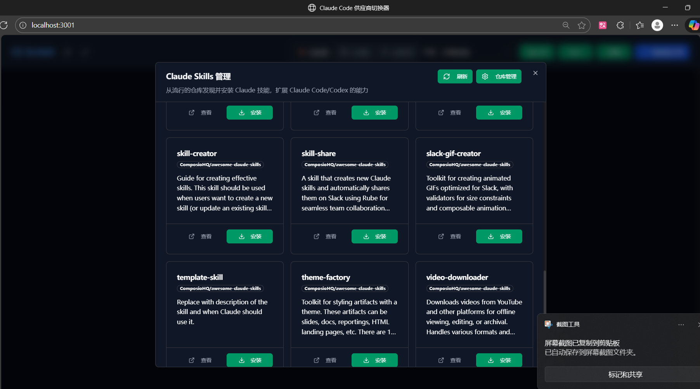
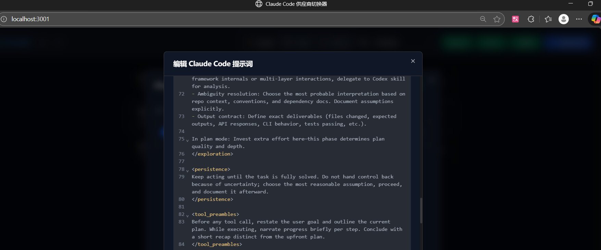
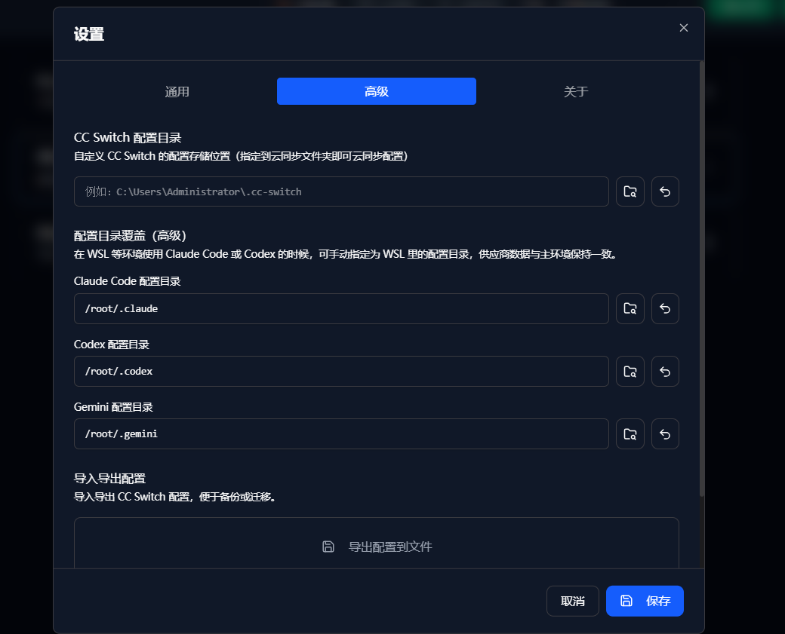

# CC-Switch-Web — Web/Headless Assistant for Claude Code, Codex & Gemini CLI

English | [中文](README_ZH.md) | [Changelog](CHANGELOG.md)

CC-Switch-Web is a unified configuration management tool for **Claude Code**, **Codex**, and **Gemini CLI**. It provides both a desktop application and a web server mode for managing AI CLI providers, MCP servers, skills, and system prompts.

## Features

- **Multi-Provider Management**: Switch between different AI providers (OpenAI-compatible endpoints) with one click
- **Unified MCP Management**: Configure Model Context Protocol servers across Claude/Codex/Gemini
- **Skills Marketplace**: Browse and install Claude skills from GitHub repositories
- **Prompt Management**: Create and manage system prompts with a built-in CodeMirror editor
- **Backup Auto-failover**: Automatically switch to backup providers when primary fails
- **Import/Export**: Backup and restore all configurations with version history
- **Cross-platform**: Available for Windows, macOS, Linux (desktop) and Web/Docker (server)

## Quick Start

### Option 1: Desktop Application (Option2 is Recommended if use linux)

Download the latest release for your platform:

| Platform | Download |
|----------|----------|
| **Windows** | [CC-Switch-v0.3.0-Windows.msi](https://github.com/LITLAY2004/CC-Switch-Web/releases/download/v0.3.0/CC-Switch-v0.3.0-Windows.msi) (Installer) |
| | [CC-Switch-v0.3.0-Windows-Portable.zip](https://github.com/LITLAY2004/CC-Switch-Web/releases/download/v0.3.0/CC-Switch-v0.3.0-Windows-Portable.zip) (Portable) |
| **macOS** | [CC-Switch-v0.3.0-macOS.zip](https://github.com/LITLAY2004/CC-Switch-Web/releases/download/v0.3.0/CC-Switch-v0.3.0-macOS.zip) |
| **Linux** | [CC-Switch-v0.3.0-Linux.AppImage](https://github.com/LITLAY2004/CC-Switch-Web/releases/download/v0.3.0/CC-Switch-v0.3.0-Linux.AppImage) |
| | [CC-Switch-v0.3.0-Linux.deb](https://github.com/LITLAY2004/CC-Switch-Web/releases/download/v0.3.0/CC-Switch-v0.3.0-Linux.deb) (Debian/Ubuntu) |

**macOS Note**: If you see "damaged" warning, run: `xattr -cr "/Applications/CC Switch.app"`

**Linux AppImage**: Make executable first: `chmod +x CC-Switch-*.AppImage`

**Linux One-Line Install** (recommended):

```bash
curl -fsSL https://raw.githubusercontent.com/LITLAY2004/CC-Switch-Web/main/scripts/install.sh | bash
```

This script will:
- Auto-detect your architecture (x86_64/aarch64)
- Download the latest AppImage release
- Verify SHA256 checksum (if available)
- Install to `~/.local/bin/ccswitch` (user) or `/usr/local/bin/ccswitch` (root)
- Create desktop entry and application icon

**Advanced options**:
```bash
# Install specific version
VERSION=v0.3.0 curl -fsSL https://...install.sh | bash

# Skip checksum verification
NO_CHECKSUM=1 curl -fsSL https://...install.sh | bash
```

### Option 2: Web Server Mode (Headless/Cloud)

For server environments without GUI:

**One-Line Deploy** (recommended):

```bash
curl -fsSL https://raw.githubusercontent.com/LITLAY2004/CC-Switch-Web/main/scripts/deploy-web.sh | bash
```

This script will:
- Check and install system dependencies (Node.js, pnpm, Rust, Linux build tools)
- Clone the repository to `~/cc-switch-web`
- Build frontend assets and Rust backend
- Create a startup script

**Advanced options**:
```bash
# Custom install directory and port
INSTALL_DIR=/opt/cc-switch PORT=8080 curl -fsSL https://...deploy-web.sh | bash

# Create systemd service for auto-start
CREATE_SERVICE=1 curl -fsSL https://...deploy-web.sh | bash
```

**Manual installation**:

```bash
# 1. Clone and install dependencies
git clone https://github.com/LITLAY2004/CC-Switch-Web.git
cd CC-Switch-Web
pnpm install

# 2. Build web assets
pnpm build:web

# 3. Build and run server
cd src-tauri
cargo build --release --features web-server --example server
HOST=0.0.0.0 PORT=3000 ./target/release/examples/server
```

- **Login**: `admin` / password in `~/.cc-switch/web_password` (auto-generated on first run)
- **CORS**: Same-origin by default; set `CORS_ALLOW_ORIGINS=https://your-domain.com` for cross-origin
- **Note**: Web mode doesn't support native file pickers—enter paths manually

## Usage Guide

### 1. Adding a Provider

1. Launch CC-Switch and select your target app (Claude Code / Codex / Gemini)
2. Click **"Add Provider"** button
3. Choose a preset (e.g., OpenRouter, DeepSeek, GLM) or select "Custom"
4. Fill in:
   - **Name**: Display name for this provider
   - **Base URL**: API endpoint (e.g., `https://api.openrouter.ai/v1`)
   - **API Key**: Your API key for this provider
   - **Model** (optional): Specific model to use
5. Click **Save**

### 2. Switching Providers

- Click the **"Enable"** button on any provider card to activate it
- The active provider will be written to your CLI's config file immediately
- Use system tray menu for quick switching without opening the app

### 3. Managing MCP Servers

1. Go to **MCP** tab
2. Click **"Add Server"** to configure a new MCP server
3. Choose transport type: `stdio`, `http`, or `sse`
4. For stdio servers, provide the command and arguments
5. Enable/disable servers with the toggle switch

### 4. Installing Skills (Claude only)

1. Go to **Skills** tab
2. Browse available skills from configured repositories
3. Click **"Install"** to add a skill to `~/.claude/skills/`
4. Manage installed skills and add custom repositories

### 5. System Prompts

1. Go to **Prompts** tab
2. Create new prompts or edit existing ones
3. Enable a prompt to write it to the CLI's prompt file:
   - Claude: `~/.claude/CLAUDE.md`
   - Codex: `~/.codex/AGENTS.md`
   - Gemini: `~/.gemini/GEMINI.md`

## Configuration Files

CC-Switch manages these configuration files:

| App | Config Files |
|-----|--------------|
| **Claude Code** | `~/.claude.json` (MCP), `~/.claude/settings.json` |
| **Codex** | `~/.codex/auth.json`, `~/.codex/config.toml` |
| **Gemini** | `~/.gemini/.env`, `~/.gemini/settings.json` |

CC-Switch's own config: `~/.cc-switch/config.json`

## Screenshots

| Skills Marketplace | Prompt Editor | Advanced Settings |
| :--: | :--: | :--: |
|  |  |  |

## Development

```bash
# Install dependencies
pnpm install

# Run desktop app in dev mode
pnpm tauri dev

# Run only the frontend dev server
pnpm dev:renderer

# Build desktop app
pnpm tauri build

# Build web assets only
pnpm build:web

# Run tests
pnpm test
```

## Tech Stack

- **Frontend**: React 18, TypeScript, Vite, Tailwind CSS, TanStack Query, Radix UI, CodeMirror
- **Backend**: Rust, Tauri 2.x, Axum (web server mode), tower-http
- **Tooling**: pnpm, Vitest, MSW

## Changelog

See [CHANGELOG.md](CHANGELOG.md) — Current version: **v0.3.0**

## Credits

This project is a fork of **cc-switch** by Jason Young (farion1231). The upstream Tauri desktop app unified provider switching, MCP management, skills, and prompts with strong i18n and safety. CC-Switch-Web adds web/server runtime, CORS controls, Basic Auth, more templates, and documentation for cloud/headless deployment.

## License

MIT License — See [LICENSE](LICENSE) for details.
