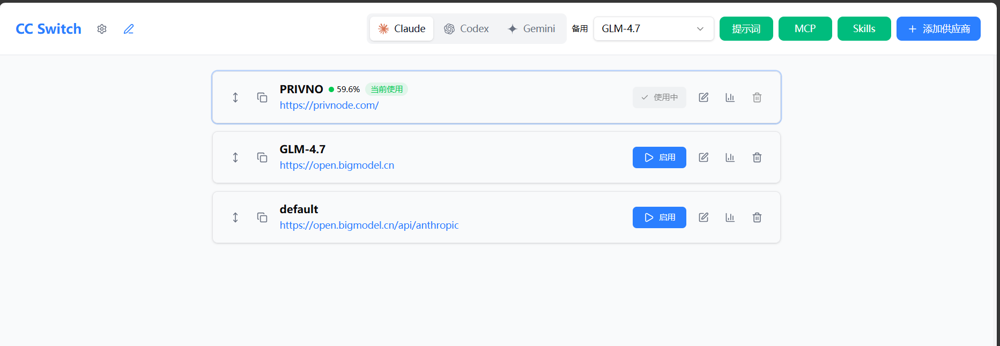
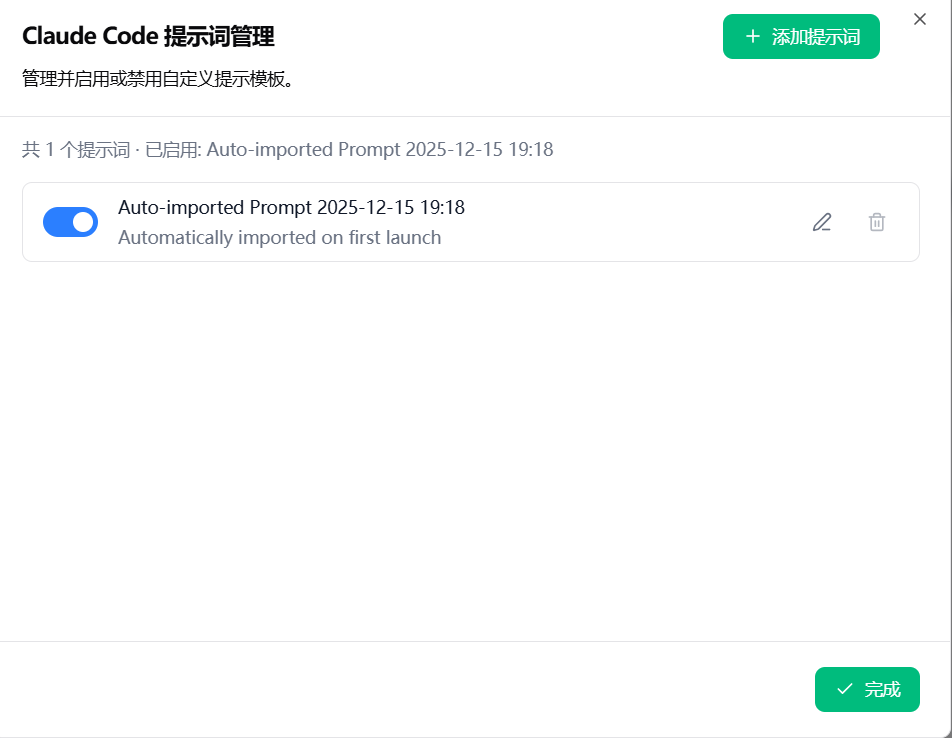
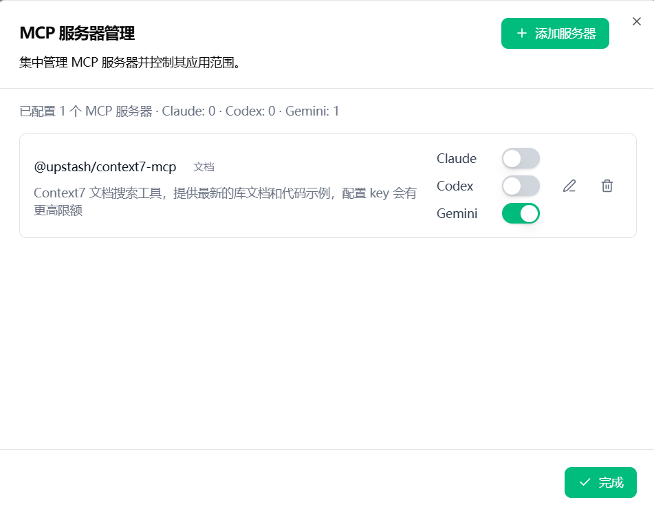
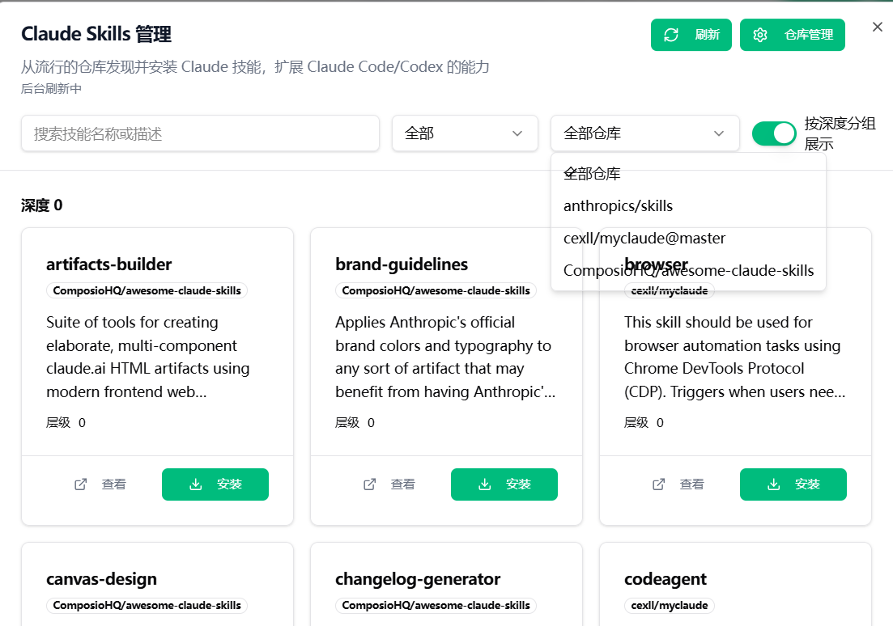
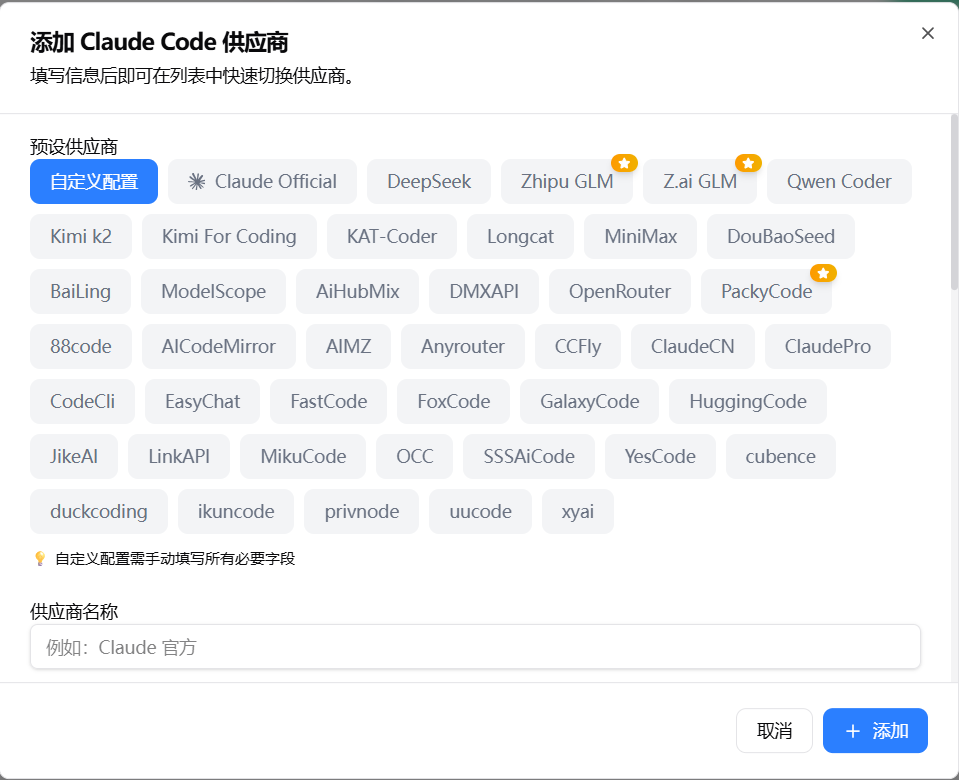
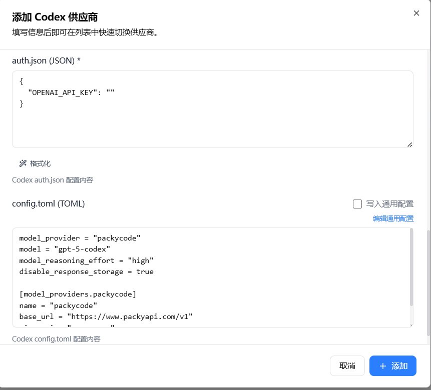

# CC-Switch-Web

<sub>🙏 本项目是 [farion1231/cc-switch](https://github.com/farion1231/cc-switch)（Jason Young）的 fork 版本。感谢原作者的出色工作。本 fork 添加了 Web 服务器模式，支持云端/无头部署。</sub>

[](https://github.com/Laliet/CC-Switch-Web/releases/latest)
[](LICENSE)
[](https://github.com/Laliet/CC-Switch-Web/releases/latest)
[](https://github.com/Laliet/CC-Switch-Web/releases/latest)
[](https://github.com/Laliet/CC-Switch-Web/releases/latest)
[](https://github.com/Laliet/CC-Switch-Web/pkgs/container/cc-switch-web)

**Claude Code / Codex / Gemini CLI 一站式配置管理助手**

[English](README.md) | 中文 | [更新日志](CHANGELOG.md)

---

## 项目简介

**CC-Switch-Web** 是一个统一的 AI CLI 配置管理工具，支持 **Claude Code**、**Codex** 和 **Gemini CLI**。提供桌面应用和 Web 服务器两种运行模式，用于管理 AI 供应商、MCP 服务器、技能和系统提示词。

无论你是在本地开发还是在无图形界面的云端环境，CC-Switch-Web 都能提供流畅的体验：

- **一键切换供应商** — 支持 OpenAI 兼容 API 端点
- **统一 MCP 管理** — 跨 Claude/Codex/Gemini 三大 CLI 工具
- **技能市场** — 从 GitHub 浏览并安装 Claude 技能
- **提示词编辑器** — 内置语法高亮
- **配置备份/恢复** — 支持版本历史
- **Web 服务器模式** — 支持 Basic Auth，适用于云端/无头部署

---

## 更新内容

### v0.7.1 - CI 和类型检查修复
- 修复 GitHub Actions CI 工作流配置
- 解决 TypeScript 类型检查问题
- 提升构建可靠性

### v0.7.0 - Web 稳定性与 Skills 性能
- Skills 仓库缓存与条件刷新（ETag/Last-Modified）
- 通过环境变量 `CC_SWITCH_SKILLS_CACHE_TTL_SECS` 配置缓存 TTL，获取失败回退缓存
- Web API 基地址可覆盖，并在 `WebLoginDialog` 中更安全地校验
- Web 模式读取实时配置并写入默认供应商（不切换 current）
- Web 切换后与实时配置同步，失败时返回明确错误
- Skills 体验：页面状态行显示"缓存命中/后台刷新"

## 界面展示


*主界面*


*提示词管理*


*MCP服务器管理*


*技能商店*


*扩展供应商列表*


*配置供应商*

---

## 功能特性

### 核心功能
- **多供应商管理**：一键切换不同 AI 供应商（OpenAI 兼容端点）
- **统一 MCP 管理**：跨 Claude/Codex/Gemini 配置 Model Context Protocol 服务器
- **技能市场**：从 GitHub 仓库浏览并安装 Claude 技能
- **提示词管理**：内置 CodeMirror 编辑器创建和管理系统提示词

### 扩展功能
- **备用供应商自动切换**：主供应商失败时自动切换到备用
- **导入/导出**：备份和恢复所有配置，支持版本历史
- **跨平台**：支持 Windows、macOS、Linux（桌面版）和 Web/Docker（服务器版）

---

## 快速开始

### 方式一：Web 服务器模式（推荐）

推荐优先使用 Web 服务器模式，尤其适合云端/无头部署与远程访问。

轻量级 Web 服务器，适用于无图形界面的服务器环境。通过浏览器访问，无需 GUI 依赖。

#### 方法 A：预编译二进制（推荐）

下载预编译的服务器二进制，无需编译：

| 架构 | 下载链接 |
|------|----------|
| **Linux x86_64** | [cc-switch-server-linux-x86_64](https://github.com/Laliet/CC-Switch-Web/releases/download/v0.7.1/cc-switch-server-linux-x86_64) |
| **Linux aarch64** | [cc-switch-server-linux-aarch64](https://github.com/Laliet/CC-Switch-Web/releases/download/v0.7.1/cc-switch-server-linux-aarch64) |

**一键部署**：
```bash
curl -fsSL https://raw.githubusercontent.com/Laliet/CC-Switch-Web/main/scripts/deploy-web.sh | bash -s -- --prebuilt
```

**高级选项**：
```bash
# 自定义安装目录和端口
INSTALL_DIR=/opt/cc-switch PORT=8080 curl -fsSL https://raw.githubusercontent.com/Laliet/CC-Switch-Web/main/scripts/deploy-web.sh | bash -s -- --prebuilt

# 创建 systemd 服务（开机自启）
CREATE_SERVICE=1 curl -fsSL https://raw.githubusercontent.com/Laliet/CC-Switch-Web/main/scripts/deploy-web.sh | bash -s -- --prebuilt
```

#### 方法 B：Docker 容器

Docker 镜像发布到 GitHub Container Registry (ghcr.io)：

```bash
docker run -p 3000:3000 ghcr.io/laliet/cc-switch-web:latest
```

> ⚠️ **注意**：Docker 镜像名必须**全小写**（`laliet`，不是 `Laliet`）

**Docker 高级选项**：
```bash
# 使用部署脚本（自定义端口/版本/数据目录、可后台运行）
./scripts/docker-deploy.sh -p 8080 --data-dir /opt/cc-switch-data -d

# 本地构建镜像（可选）
docker build -t cc-switch-web .
docker run -p 3000:3000 cc-switch-web
```

#### 方法 C：源码构建

依赖：`libssl-dev`、`pkg-config`、Rust 1.78+、pnpm（无需 WebKit/GTK）

```bash
# 1. 克隆并安装依赖
git clone https://github.com/Laliet/CC-Switch-Web.git
cd CC-Switch-Web
pnpm install

# 2. 构建 Web 资源
pnpm build:web

# 3. 构建并运行服务器
cd src-tauri
cargo build --release --features web-server --example server
HOST=0.0.0.0 PORT=3000 ./target/release/examples/server
```

### Web 服务器登录

- **用户名**：`admin`
- **密码**：首次运行自动生成，保存在 `~/.cc-switch/web_password`
- **跨域设置**：默认同源；需跨域请设置 `CORS_ALLOW_ORIGINS=https://your-domain.com`
- **注意**：Web 模式不支持原生文件选择器，请手动输入路径

### 安全

**认证**：
- 所有 API 请求都需要 Basic Auth
- 浏览器会弹出用户名/密码提示
- 对非 GET 请求会自动注入并校验 CSRF Token

**安全响应头**：
- 默认启用 HSTS（HTTP Strict Transport Security）
- X-Frame-Options: DENY（防止点击劫持）
- X-Content-Type-Options: nosniff
- Referrer-Policy: no-referrer

**最佳实践**：
- 生产环境建议在反向代理后部署，并启用 TLS
- 仅在充分理解风险的情况下设置 `ALLOW_HTTP_BASIC_OVER_HTTP=1` 以抑制 HTTP 警告
- 请妥善保护 `~/.cc-switch/web_password` 文件（权限建议 0600）

**环境变量**：
| 变量 | 说明 | 默认值 |
|------|------|--------|
| `PORT` | 服务端口 | 3000 |
| `HOST` | 监听地址 | 127.0.0.1 |
| `ENABLE_HSTS` | 是否启用 HSTS 响应头 | true |
| `CORS_ALLOW_ORIGINS` | 允许的来源（逗号分隔） | （同源） |
| `CORS_ALLOW_CREDENTIALS` | 是否允许 CORS 携带凭据 | false |
| `ALLOW_HTTP_BASIC_OVER_HTTP` | 抑制 HTTP 警告 | false |
| `WEB_CSRF_TOKEN` | 覆盖 CSRF Token | （自动生成） |

### 方式二：桌面应用（GUI）

功能完整的桌面应用，带图形界面，基于 Tauri 构建。

| 平台 | 下载链接 | 说明 |
|------|----------|------|
| **Windows** | [CC-Switch-v0.7.1-Windows.msi](https://github.com/Laliet/CC-Switch-Web/releases/download/v0.7.1/CC-Switch-v0.7.1-Windows.msi) | 安装版（推荐） |
| | [CC-Switch-v0.7.1-Windows-Portable.zip](https://github.com/Laliet/CC-Switch-Web/releases/download/v0.7.1/CC-Switch-v0.7.1-Windows-Portable.zip) | 绿色版（免安装） |
| **macOS** | [CC-Switch-v0.7.1-macOS.zip](https://github.com/Laliet/CC-Switch-Web/releases/download/v0.7.1/CC-Switch-v0.7.1-macOS.zip) | 通用二进制（Intel + Apple Silicon） |
| **Linux** | [CC-Switch-v0.7.1-Linux.AppImage](https://github.com/Laliet/CC-Switch-Web/releases/download/v0.7.1/CC-Switch-v0.7.1-Linux.AppImage) | AppImage（通用） |
| | [CC-Switch-v0.7.1-Linux.deb](https://github.com/Laliet/CC-Switch-Web/releases/download/v0.7.1/CC-Switch-v0.7.1-Linux.deb) | Debian/Ubuntu 包 |

**macOS 提示**：如遇"已损坏"警告，在终端执行：`xattr -cr "/Applications/CC Switch.app"`

**Linux AppImage**：先添加执行权限：`chmod +x CC-Switch-*.AppImage`

**Linux 一键安装**（推荐）：

```bash
curl -fsSL https://raw.githubusercontent.com/Laliet/CC-Switch-Web/main/scripts/install.sh | bash
```

该脚本会：
- 自动检测系统架构（x86_64/aarch64）
- 下载最新版 AppImage
- 校验 SHA256（如有校验文件）
- 安装到 `~/.local/bin/ccswitch`（普通用户）或 `/usr/local/bin/ccswitch`（root）
- 创建桌面快捷方式和应用图标

**高级选项**：
```bash
# 安装指定版本
VERSION=v0.7.1 curl -fsSL https://...install.sh | bash

# 跳过校验
NO_CHECKSUM=1 curl -fsSL https://...install.sh | bash
```

---

## 使用指南

### 1. 添加供应商

1. 启动 CC-Switch，选择目标应用（Claude Code / Codex / Gemini）
2. 点击 **"添加供应商"** 按钮
3. 选择预设（如 OpenRouter、DeepSeek、智谱 GLM）或选择"自定义"
4. 填写配置：
   - **名称**：供应商显示名称
   - **Base URL**：API 端点（如 `https://api.openrouter.ai/v1`）
   - **API Key**：该供应商的 API 密钥
   - **模型**（可选）：指定使用的模型
5. 点击 **保存**

### 2. 切换供应商

- 点击任意供应商卡片上的 **"启用"** 按钮即可激活
- 激活的供应商配置会立即写入 CLI 配置文件
- 使用系统托盘菜单可快速切换，无需打开应用窗口

### 3. 管理 MCP 服务器

1. 进入 **MCP** 标签页
2. 点击 **"添加服务器"** 配置新的 MCP 服务器
3. 选择传输类型：`stdio`、`http` 或 `sse`
4. 对于 stdio 服务器，提供命令和参数
5. 使用开关启用/禁用服务器

### 4. 安装技能（仅 Claude）

1. 进入 **技能** 标签页
2. 浏览已配置仓库中的可用技能
3. 点击 **"安装"** 将技能添加到 `~/.claude/skills/`
4. 管理已安装的技能，可添加自定义仓库

### 5. 系统提示词

1. 进入 **提示词** 标签页
2. 创建新提示词或编辑现有提示词
3. 启用提示词后会写入对应 CLI 的提示词文件：
   - Claude: `~/.claude/CLAUDE.md`
   - Codex: `~/.codex/AGENTS.md`
   - Gemini: `~/.gemini/GEMINI.md`

---

## 配置文件

CC-Switch 管理以下配置文件：

| 应用 | 配置文件 |
|------|----------|
| **Claude Code** | `~/.claude.json`（MCP）、`~/.claude/settings.json` |
| **Codex** | `~/.codex/auth.json`、`~/.codex/config.toml` |
| **Gemini** | `~/.gemini/.env`、`~/.gemini/settings.json` |

CC-Switch 自身配置：`~/.cc-switch/config.json`

---

## 开发

```bash
# 安装依赖
pnpm install

# 开发模式运行桌面应用
pnpm tauri dev

# 仅运行前端开发服务器
pnpm dev:renderer

# 构建桌面应用
pnpm tauri build

# 仅构建 Web 资源
pnpm build:web

# 运行测试
pnpm test
```

---

## 技术栈

- **前端**：React 18、TypeScript、Vite、Tailwind CSS、TanStack Query、Radix UI、CodeMirror
- **后端**：Rust、Tauri 2.x、Axum（Web 服务器模式）、tower-http
- **工具链**：pnpm、Vitest、MSW

---

## 更新日志

参见 [CHANGELOG.md](CHANGELOG.md) — 当前版本：**v0.7.1**

---

## 致谢

本项目基于 Jason Young (farion1231) 的开源项目 **[cc-switch](https://github.com/farion1231/cc-switch)** 二次开发。衷心感谢原作者创建了如此优秀的开源项目，为本项目奠定了坚实基础。没有上游项目的开拓性工作，就不会有 CC-Switch-Web 的诞生。

上游 Tauri 桌面应用统一了供应商切换、MCP 管理、技能和提示词功能，具备完善的国际化和安全特性。CC-Switch-Web 在此基础上增加了 Web/服务器运行模式、CORS 控制、Basic Auth、更多模板，以及云端/无头部署文档。

---

## 许可证

MIT License — 详见 [LICENSE](LICENSE)
